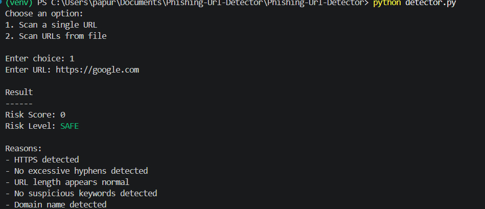
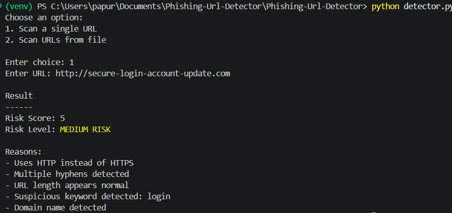
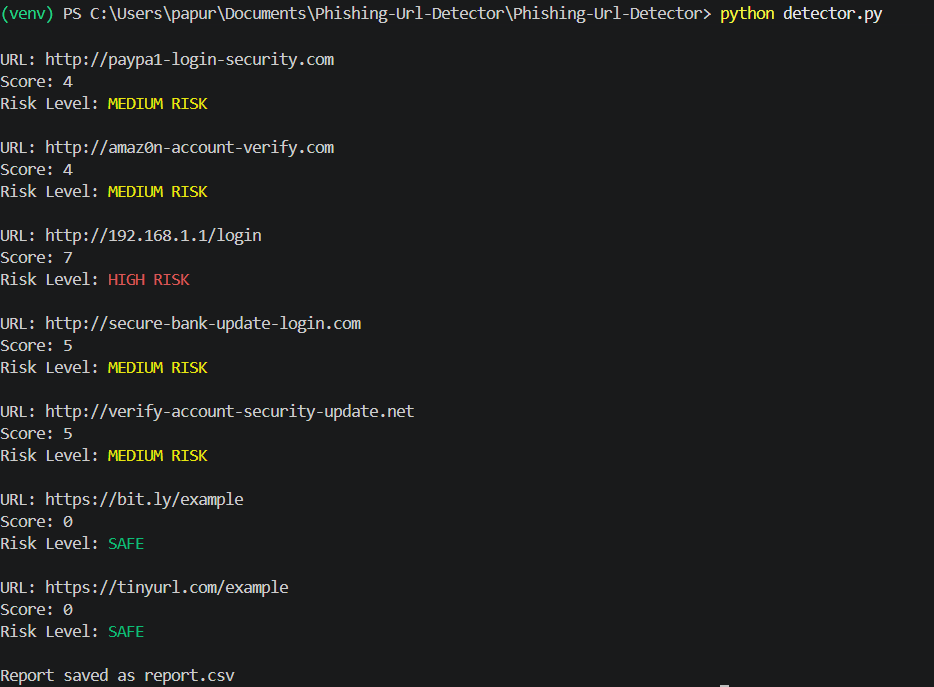
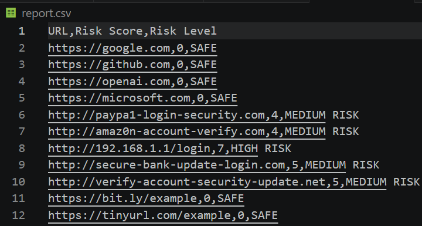

# Phishing URL Detector

## Overview

Phishing websites are commonly used by attackers to steal user credentials, banking information, and personal data. This project is a Python-based phishing URL detector that analyzes URLs using multiple security indicators and assigns a risk score.

The detector evaluates a URL based on predefined phishing characteristics and classifies it into different risk categories.

## Features

* Single URL scanning
* Batch URL scanning from a text file
* Risk score calculation
* Risk level classification
* CSV report generation
* Color-coded terminal output

## Detection Techniques

The detector analyzes URLs using the following indicators:

* HTTPS availability
* URL length analysis
* Suspicious keyword detection
* Excessive hyphen detection
* IP address usage instead of domain names

## Risk Levels

| Score Range | Classification |
| ----------- | -------------- |
| 0 - 2       | SAFE           |
| 3 - 5       | MEDIUM RISK    |
| 6 - 8       | HIGH RISK      |
| 9+          | VERY HIGH RISK |

## Technologies Used

* Python
* urllib.parse
* ipaddress
* csv
* colorama

## Project Structure

```text
Phishing-Url-Detector/
│
├── detector.py
├── sample-url.txt
├── report.csv
├── screenshots/
├── requirements.txt
├── LICENSE
└── README.md
```

## Installation

Clone the repository:

```bash
git clone https://github.com/YourUsername/Phishing-Url-Detector.git
cd Phishing-Url-Detector
```

Install dependencies:

```bash
pip install -r requirements.txt
```

## Usage

Run the detector:

```bash
python detector.py
```

Select one of the following options:

1. Scan a single URL
2. Scan multiple URLs from a file

## Screenshots

### Safe URL Detection



### Phishing URL Detection



### Batch Scan



### Generated CSV Report



## Learning Outcomes

This project helped develop practical experience in:

* URL analysis techniques
* Cybersecurity fundamentals
* Python scripting
* File handling
* Report generation
* Git and GitHub workflow

## Future Improvements

* Machine Learning based detection
* GUI application
* Browser extension integration
* Real-time threat intelligence feeds
* Domain reputation analysis

## License

This project is licensed under the MIT License.
